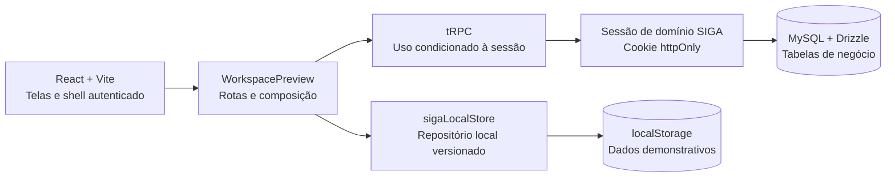

# Memória do Projeto — SIGA SEMED

> **Finalidade.** Esta é a memória técnica e funcional do SIGA SEMED. Ela foi escrita para que uma nova pessoa na equipe consiga entender o propósito do sistema, sua arquitetura, os fluxos em funcionamento, os limites de segurança e a ordem adequada de evolução sem depender do histórico da conversa do projeto.

| Metadado | Registro |
|---|---|
| Projeto | SIGA SEMED — Sistema Integrado de Gestão e Acompanhamento. |
| Atualização | 27 de agosto de 2026, após a segunda leva de persistência real. |
| Redação | Manus AI. |
| Público | Pessoas responsáveis por produto, frontend, backend, testes e operação técnica. |
| Documento de apoio | [`PROJECT_PROGRESS.md`](./PROJECT_PROGRESS.md), histórico detalhado de decisões, testes e checkpoints. |

## 1. Visão geral

O SIGA SEMED é uma reconstrução independente de um sistema de gestão educacional municipal. O projeto preserva os **setores, fluxos, permissões, cálculos e relações funcionais** observados em uma referência externa somente para leitura, mas utiliza código, modelos e dados demonstrativos próprios. A referência não é ambiente de integração e não deve receber qualquer escrita.

O sistema foi construído para operar inicialmente como um preview seguro no navegador e evoluir, de maneira controlada, para persistência compartilhada no banco do próprio projeto. Portanto, a evolução do SIGA SEMED **não é uma migração do sistema de referência** e não autoriza importar seus registros.[1] [2]

| Aspecto | Situação atual |
|---|---|
| Cliente | React 19, Vite e TypeScript. |
| Servidor | Express e tRPC, com contratos tipados entre cliente e servidor. |
| Banco do projeto | MySQL administrado com Drizzle ORM, adotado por módulos. |
| Modo demonstrativo | `localStorage` versionado e reidratável, preservado como fallback. |
| Login visual | Oficial e congelado; não deve ser redesenhado sem autorização explícita. |
| Dados da referência | Não são lidos, copiados, migrados, sincronizados nem publicados. |

## 2. Regras inegociáveis de manutenção

| Princípio | Aplicação prática |
|---|---|
| Preservar o funcionamento | Não remover rotas, itens de menu, campos, fluxos, filtros, permissões ou cálculos ao aprimorar layout ou backend. |
| Manter o login congelado | Não alterar composição, cores, fontes, ilustração, campos ou comportamento visual da área de acesso. |
| Usar dados demonstrativos | Não inserir dados reais, documentos reais, matrículas reais, credenciais, tokens, senhas ou identificadores externos em código, testes, documentação ou commits. |
| Tratar a referência como somente leitura | Nunca criar, editar, excluir, baixar, exportar ou sincronizar registros da referência externa. |
| Migrar por etapas | Cada módulo deve ter modelo Drizzle, migração não destrutiva, procedimentos protegidos, fallback e testes antes de ativar a camada real. |
| Publicar com higiene | Antes de qualquer envio, revisar `git diff --check`, arquivos alterados e padrões de segredo; não publicar capturas, ZIPs, anexos ou utilitários temporários. |

## 3. Arquitetura em funcionamento

O cliente é organizado por páginas de setor e por um shell operacional que concentra a navegação lateral, cabeçalho, permissões e rotas internas. `WorkspacePreview.tsx` é o ponto de composição do ambiente autenticado. `sigaLocalStore.ts` é o repositório demonstrativo: nele estão os tipos, o esquema local versionado, a reidratação, as validações e as políticas já aprovadas.

O servidor possui uma infraestrutura tRPC e Drizzle pronta para expansão. A camada de negócio só alcança o banco quando o servidor resolve uma sessão válida de domínio SIGA. Sem sessão válida, a interface continua no modo local, sem copiar registros entre as duas fontes.[2]

| Caminho | Responsabilidade |
|---|---|
| `client/src/pages/WorkspacePreview.tsx` | Shell autenticado, rotas internas e escolha condicionada de persistência. |
| `client/src/pages/sigaLocalStore.ts` | Modelo local v12, dados demonstrativos, migrações locais, permissões e operações dos módulos ainda locais. |
| `client/src/pages/` | Páginas e estilos específicos dos setores. |
| `client/src/lib/trpc.ts` | Cliente tipado para os procedimentos tRPC. |
| `server/routers.ts` | Composição do roteador principal. |
| `server/routers/semedDomain.ts` | Disponibilidade e sessão do domínio SIGA. |
| `server/routers/semedInitial.ts` | Cadastros Gerais e operações do painel Início já persistíveis. |
| `server/routers/semedSchools.ts` | Unidades Escolares e Turmas já persistíveis. |
| `server/semedDomainAuth.ts` | Resolução de sessão, ator de domínio e autorização por perfil/módulo. |
| `drizzle/schema.ts` | Esquema Drizzle de autenticação, identidades, permissões, sessões e tabelas de negócio. |
| `drizzle/0000_adorable_maria_hill.sql` | Migração da primeira leva de negócio: Cadastros Gerais, Agenda, Mensagens, leituras e Lembretes. |
| `drizzle/0001_hard_diamondback.sql` | Migração de usuários, permissões e sessões do domínio SIGA. |
| `drizzle/0002_salty_xorn.sql` | Migração não destrutiva de Unidades Escolares e Turmas. |

## 4. Persistência e compatibilidade

O SIGA SEMED possui duas camadas de armazenamento com papéis diferentes. Elas coexistem para permitir evolução sem quebrar o preview, mas **não são espelhos uma da outra**.

| Camada | Situação | Uso permitido | Garantia importante |
|---|---|---|---|
| `localStorage` | Ativo no preview | Dados demonstrativos, validação manual e continuidade da interface. | Um registro local não é copiado automaticamente para o banco. |
| MySQL/Drizzle | Parcialmente integrado | Dados de módulos já migrados, quando há sessão de domínio válida. | Só é acessado por procedimentos tRPC protegidos. |
| Cloudflare D1 da referência | Fora do escopo | Nenhum. | Não há leitura, escrita, sincronização ou migração automática. |

### 4.1 Sessão de domínio

O login visual mantém o acesso por matrícula ou CPF e senha. Quando houver usuários ativos no diretório de domínio, o servidor validará a identidade e emitirá um token opaco em cookie `httpOnly`. O token não armazena nem substitui a senha. Antes de liberar operações de negócio, o servidor resolve perfil, situação e permissões.

No estado atual, não há usuários de domínio ativos; por isso, o preview permanece propositalmente no fluxo local. Essa decisão evita bloquear a demonstração e impede a ativação acidental de uma base real vazia.[2]

### 4.2 Regra de fallback

O fallback não é mecanismo de migração nem sincronização. Ao integrar um novo módulo com MySQL, devem ser preservados os tipos públicos, formulários, rotas e comportamentos que já funcionam no modo local. A alteração deve se limitar à decisão de origem para leitura e gravação, seguindo o desenho de compatibilidade documentado.[2]

> **Não contorne o fallback.** Ter uma conexão de banco disponível não autoriza usar persistência real sem usuário de domínio, sessão válida, permissões resolvidas e validação da interface.

## 5. Perfis e autorização

O ambiente demonstrativo possui seis perfis funcionais. A mesma lógica está sendo reproduzida na camada de domínio para os módulos já migrados.[3]

| Perfil | Papel operacional predominante |
|---|---|
| Administrador | Gestão integral de cadastros, permissões e operações administrativas. |
| Técnico | Atuação limitada aos módulos e permissões explicitamente concedidos. |
| Gestor Escolar | Leitura e escopo restrito à unidade escolar vinculada. |
| Secretário Escolar | Operações escolares restritas ao escopo da unidade. |
| Auditoria Externa | Consulta e auditoria, sem escrita operacional. |
| Contadora Municipal | Consulta e atuação restrita aos fluxos financeiros permitidos. |

Nas Unidades Escolares, o Administrador pode gerir integralmente o fluxo. Um Técnico precisa da permissão geral de Unidades ou, exclusivamente para Turmas, da permissão `unidades.turmas`. Os demais perfis não recebem escrita nessa área apenas por terem permissão de leitura.

## 6. Módulos e estado de persistência

| Setor | Capacidades principais | Persistência atual |
|---|---|---|
| Início | Indicadores, agenda, prazos, ações rápidas e comunicação. | Agenda, Mensagens e Lembretes já possuem banco condicional; demais elementos permanecem locais. |
| Cadastros Gerais | Referências institucionais, pessoas, contatos, departamentos, cargos, fornecedores e entidades. | Banco condicional e fallback local. |
| Unidades Escolares e Turmas | Identificação, censo, matrículas, infraestrutura, acessibilidade, classificação escolar e turmas por INEP/ano. | Banco condicional e fallback local. |
| Gestão e Governança | Tarefas, alertas, aprovações, devoluções, anexos locais, auditoria e relatórios CSV. | Local. |
| Contratos, Processos e Documentos | Processos, documentos, pagamentos, filtros e confirmações. | Local. |
| Estoque | Catálogos, saldos, movimentações, conferências, auditoria e relatórios. | Local. |
| Agricultura Familiar | Entidades, contratos, produtos, planos, guias, recebimentos e faturamentos. | Local. |
| Nutrição | Planejamentos, análise de saldos, dias letivos, necessidades e cobertura. | Local. |
| Financeiro | Planejamento, receitas, execução, fontes, relatórios e alertas preventivos. | Local. |
| Recursos Humanos | Servidores, competências, ficha financeira, holerites, frequência e relatórios. | Local. |
| Educa Paço | Núcleos, capacidades, atividades e modalidades. | Local. |
| PDDE/FNDE | Unidade Executora, contas por exercício e prestação de contas. | Local. |
| Frota | Veículos, abastecimento, manutenção, ocorrências e relatórios. | Local. |
| Configurações | Parâmetros institucionais e auditoria administrativa. | Local. |
| Usuários | Usuários demonstrativos, primeiro acesso, perfis, permissões e auditoria. | Local, com identidade de domínio já preparada no servidor. |

## 7. Fluxos que merecem atenção especial

### 7.1 Acesso e primeiro acesso

O acesso aceita matrícula ou CPF como identificador. Usuários em primeiro acesso passam pela troca local obrigatória antes de usar o shell. A área visual de login é aprovada e deve permanecer intacta em tarefas de backend ou de módulos internos.

### 7.2 Início, Agenda, Mensagens e Lembretes

O painel Início reúne indicadores, agenda, prazos, ações rápidas e comunicação interna. Eventos podem ser criados, concluídos e consultados; mensagens têm destinatário e confirmação de leitura individual; lembretes pertencem ao usuário. Essas coleções substituíram exemplos fixos e foram incluídas na primeira leva de banco, mantendo o fallback local.[1] [2]

### 7.3 Cadastros Gerais

Cadastros Gerais concentra referências reutilizáveis. O fluxo valida código e nome, protege a unicidade do código e mantém pesquisa, filtro, cadastro e edição. No ambiente com sessão válida, as mesmas regras estão disponíveis pelos procedimentos tRPC protegidos.

### 7.4 Unidades Escolares e Turmas

Unidades Escolares reúne identificação institucional, campos de censo, matrículas por etapa/ano, necessidades educacionais especiais, infraestrutura, acessibilidade, referências locais e `school_type`. Turmas possui rota própria, depende de unidade escolar e utiliza INEP e ano letivo como relações de negócio. As duas entidades pertencem à segunda leva de MySQL/Drizzle e tRPC.[4]

### 7.5 Gestão e Governança

Gestão mantém tarefas, responsáveis, prioridades, alertas, aprovações, devoluções, comentários internos, metadados de anexo e relatórios CSV locais. A segregação de funções impede que solicitante e decisor ocupem papéis conflitantes na mesma aprovação. O painel Início deriva alertas e prazos respeitando a leitura permitida ao perfil atual.

### 7.6 Estoque, Nutrição e Agricultura Familiar

Estoque abrange as categorias industrializado, Kit do Aluno, alimentação escolar, limpeza, expediente e relatórios. Agricultura Familiar mantém a cadeia de entidade fornecedora, contrato, item contratado, plano por unidade, guia, recebimento e faturamento; faturamento só é permitido depois do recebimento confirmado da guia. Nutrição oferece planejamento semanal/anual, análise de saldo, dias letivos, cálculos de necessidade e cobertura. Todos esses fluxos continuam locais nesta etapa.

### 7.7 Financeiro, RH, Educa Paço, Frota, Configurações e PDDE/FNDE

O Financeiro oferece planejamento, receitas, execução, fontes, relatórios e alerta preventivo de sobrepagamento. Recursos Humanos contém servidores, competências, ficha financeira, holerite, frequência e relatórios. Educa Paço organiza núcleos, capacidades, atividades e modalidades. Frota cobre veículos, abastecimento, manutenção, ocorrências e relatórios. Configurações institucionais concentra parâmetros e auditoria com escrita administrativa restrita.

PDDE/FNDE administra Unidade Executora, contas por exercício e itens demonstrativos de prestação de contas. A conta depende de Unidade Executora; o total considera saldo reprogramado e parcelas; o primeiro item de prestação altera o estado da conta. Esses módulos ainda utilizam exclusivamente o armazenamento local.[4]

## 8. Convenções visuais

No ambiente autenticado, **Montserrat ExtraBold** é usada em títulos, chamadas e números de destaque. **Manrope** é usada em legendas, descrições, botões e controles internos. Títulos institucionais, abas, menu lateral e botões textuais que abrem módulos, janelas ou ações utilizam caixa alta. Descrições, campos, filtros, dados e conteúdos de listas permanecem em leitura normal.

Alterações visuais devem ocorrer nos estilos efetivos do módulo, com contraste adequado, quebra de linha de títulos longos e responsividade preservada. A tela de login não entra nesse escopo.[5]

## 9. Histórico de marcos

| Marco | Resultado |
|---|---|
| Reconstrução inicial | Login institucional, shell autenticado, módulos principais e dados demonstrativos locais. |
| Expansão local v12 | Cobertura ampliada para Unidades/Turmas, Agenda/Mensagens/Lembretes, Cadastros Gerais, Agricultura Familiar e PDDE/FNDE. |
| Refinamento tipográfico | Montserrat para destaques, Manrope para interface e caixa alta institucional no ambiente autenticado. |
| Backend real — primeira leva | Sessão de domínio, Cadastros Gerais, Agenda, Mensagens, leituras e Lembretes em Drizzle/tRPC com fallback. |
| Backend real — segunda leva | Unidades Escolares, Turmas, `school_type`, relações INEP/ano letivo e autorização específica em Drizzle/tRPC com fallback. |
| Estado atual | Não houve migração do D1; a ativação de dados reais depende de provisão controlada de usuários de domínio. |

O histórico cronológico, os checkpoints e o checklist verificável estão em [`PROJECT_PROGRESS.md`](./PROJECT_PROGRESS.md) e [`todo.md`](./todo.md). Esta memória é o guia narrativo que contextualiza esses registros.[1]

## 10. Testes e validação

O projeto utiliza Vitest para regras de domínio, persistência local, permissões, rotas e componentes. Uma entrega funcional deve executar a suíte, verificação de tipos, build e revisão visual proporcional ao módulo alterado. A segunda leva de backend foi validada com **116 testes aprovados**, `pnpm exec tsc --noEmit` e `pnpm build` aprovados; Unidades/Turmas foram validadas em desktop e no fallback local. A captura móvel autenticada desse fluxo não foi concluída pela sessão isolada e não deve ser declarada como validada.[1]

| Comando | Finalidade |
|---|---|
| `pnpm test` | Executa a suíte Vitest. |
| `pnpm exec tsc --noEmit` | Verifica a tipagem sem gerar arquivos. |
| `pnpm build` | Gera o bundle de produção do cliente e do servidor. |
| `pnpm run dev` | Inicia o ambiente local de desenvolvimento. |

Antes de aplicar migrações, gerar o SQL pelo Drizzle, ler integralmente o arquivo, confirmar que a alteração é não destrutiva e verificar depois o esquema e o controle de migrações do banco. Nunca tratar uma revisão de interface como substituta dos testes de regras de autorização.

## 11. Roteiro para uma nova alteração

| Etapa | Conduta esperada |
|---|---|
| Contextualizar | Ler esta memória, [`PROJECT_PROGRESS.md`](./PROJECT_PROGRESS.md), [`todo.md`](./todo.md), o desenho de compatibilidade e o roteiro de backend. |
| Localizar o domínio | Identificar página em `client/src/pages/`, modelo em `sigaLocalStore.ts`, procedimento/rota aplicável e testes associados. |
| Desenhar antes de codificar | Definir entidades, relações, permissões, transições de estado e regra de fallback. |
| Implementar com compatibilidade | Preservar formulários, rotas e comportamento local; para banco, criar schema, migração, helpers, procedimento protegido e conexão condicional. |
| Validar | Atualizar testes, executar testes/tipos/build e revisar a interface sem alterar o login. |
| Documentar e publicar | Atualizar o checklist e os documentos afetados; revisar segredos e artefatos antes de criar checkpoint e enviar ao repositório autorizado. |

## 12. Próximas etapas recomendadas

| Prioridade | Etapa | Dependência |
|---|---|---|
| 1 | Provisionar, de forma controlada, os primeiros usuários, perfis e permissões no domínio SIGA. | Processo seguro de identidade; não reutilizar contas demonstrativas como dados reais. |
| 2 | Migrar Documentos e Contratos/Processos para MySQL/Drizzle e tRPC. | Sessão de domínio e Cadastros Gerais já disponíveis. |
| 3 | Migrar Estoque e Agricultura Familiar. | Catálogos, vínculos contratuais e regras de movimentação. |
| 4 | Migrar Nutrição, Financeiro, RH, PDDE/FNDE, Educa Paço, Frota, Gestão e Configurações. | Ordem detalhada no roteiro de backend. |
| 5 | Considerar qualquer migração de dados reais apenas após destino completo, homologação e autorização específica. | Arquitetura completa, plano de migração aprovado e credenciais tratadas por canal seguro. |

## Referências internas

[1]: ./PROJECT_PROGRESS.md "Histórico consolidado do SIGA SEMED"
[2]: ./backend_compatibility_design.md "Desenho de compatibilidade entre localStorage e MySQL/tRPC"
[3]: ./users_permissions_functional_spec.md "Especificação de usuários, perfis e permissões"
[4]: ./local_field_coverage.md "Cobertura demonstrativa dos campos ampliados"
[5]: ./visual_identity_refresh.md "Diretrizes de identidade visual do ambiente autenticado"

Para contexto complementar, consulte [`backend_migration_roadmap.md`](./backend_migration_roadmap.md), [`reference_package_audit.md`](./reference_package_audit.md) e [`reproduction_before_changes.md`](./reproduction_before_changes.md). Documentos históricos podem registrar decisões já superadas; em caso de conflito, trate esta memória e o histórico consolidado como ponto de partida e confirme o comportamento no código atual.
