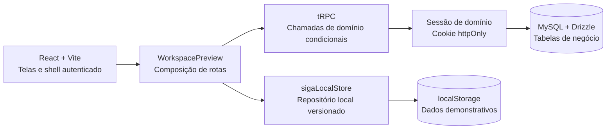

# Memória do Projeto — SIGA SEMED

> **Finalidade.** Este documento é a porta de entrada para pessoas que precisam entender, manter ou evoluir o SIGA SEMED. Ele descreve o projeto como ele está implementado hoje, separa recursos demonstrativos de recursos com persistência real e registra os limites que não podem ser ultrapassados sem nova decisão formal.

| Item | Situação atual |
|---|---|
| Aplicação | React 19, Vite e TypeScript no cliente; Express e tRPC no servidor. |
| Banco de dados | MySQL gerenciado por Drizzle, em implantação incremental. |
| Modo demonstrativo | `localStorage` versionado, preservado como fallback compatível. |
| Login visual | Oficial e congelado; não deve ser redesenhado sem autorização expressa. |
| Dados da referência | Não são lidos, copiados, migrados ou sincronizados. |
| Situação desta memória | Atualizada após a segunda leva do backend real, com Unidades Escolares e Turmas. |

## 1. O que é o SIGA SEMED

O SIGA SEMED é uma reconstrução independente de um sistema de gestão educacional municipal. A aplicação conserva os fluxos, setores, permissões e relações funcionais que foram observados na referência em modo somente leitura, mas utiliza código, estruturas e dados demonstrativos próprios. A referência não é um ambiente de integração e não deve receber qualquer escrita.

O objetivo do projeto é oferecer uma aplicação navegável e segura, inicialmente utilizável no navegador com dados demonstrativos e progressivamente preparada para persistência compartilhada no banco gerenciado do próprio projeto. A evolução não equivale a uma migração do sistema de referência.[1] [2]

## 2. Princípios que devem permanecer válidos

| Princípio | Regra prática para quem mantém o projeto |
|---|---|
| Preservação funcional | Não remover rotas, fluxos, permissões, filtros, cálculos ou operações existentes ao aprimorar telas. |
| Login congelado | Não modificar composição, cores, fontes, ilustração ou comportamento visual da tela de acesso. |
| Dados seguros | Não inserir dados reais, documentos reais, credenciais, tokens, senhas ou identificadores externos em código, testes, documentação ou commits. |
| Referência somente leitura | A referência externa serve para observação funcional; nunca para criar, editar, baixar, exportar ou sincronizar registros. |
| Migração gradual | Cada módulo só passa ao banco real depois de possuir modelo Drizzle, migração revisada, procedimentos protegidos, fallback e testes. |
| Compatibilidade | Enquanto não houver sessão válida do domínio SIGA, a tela deve continuar usando o repositório local sem alterar a experiência aprovada. |

## 3. Arquitetura atual

O cliente é organizado por páginas de setor e por um shell operacional que concentra menu lateral, cabeçalho, permissões e rotas internas. `WorkspacePreview.tsx` funciona como ponto de composição do ambiente autenticado. `sigaLocalStore.ts` é a fonte de persistência demonstrativa e contém os tipos, a versão de esquema local, a reidratação, as validações e as políticas já aprovadas.

O servidor possui uma infraestrutura tRPC e Drizzle já disponível. A camada de negócio é incremental: os procedimentos só utilizam o banco quando uma sessão de domínio SIGA válida foi resolvida pelo servidor. Caso contrário, o cliente continua no caminho local, sem cópia automática entre as duas fontes.[2]

| Diretório ou arquivo | Responsabilidade |
|---|---|
| `client/src/pages/` | Páginas de cada setor, shell operacional, repositório local e estilos específicos. |
| `client/src/lib/trpc.ts` | Cliente tipado dos procedimentos tRPC. |
| `server/routers.ts` | Composição do roteador tRPC principal. |
| `server/routers/semedDomain.ts` | Disponibilidade e sessão do domínio SIGA. |
| `server/routers/semedInitial.ts` | Cadastros Gerais e operações de Início já persistíveis no banco. |
| `server/routers/semedSchools.ts` | Unidades Escolares e Turmas já persistíveis no banco. |
| `server/semedDomainAuth.ts` | Resolução de sessão, ator de domínio e autorização por perfil e módulo. |
| `drizzle/schema.ts` | Esquema Drizzle da autenticação, identidades de domínio e tabelas de negócio. |
| `drizzle/*.sql` | Migrações geradas e revisadas antes de aplicação. |
| `server/*.test.*` | Regressões de regras de negócio, permissões, persistência, interface e navegação. |

## 4. Persistência: o que é local e o que já é real

O projeto usa dois destinos de persistência com funções distintas. Eles não devem ser confundidos.

| Camada | Situação | Uso | Regra de segurança |
|---|---|---|---|
| `localStorage` | Ativa no preview | Dados demonstrativos, testes manuais, continuidade do modo local. | Nunca promove um identificador local a credencial de servidor. |
| MySQL/Drizzle | Parcialmente integrado | Dados de negócio de módulos já migrados, quando existe sessão de domínio. | Só é acessado por procedimentos tRPC protegidos. |
| Cloudflare D1 de referência | Fora do escopo | Nenhum. | Não há leitura, escrita, sincronização nem migração automática. |

### 4.1 Sessão do domínio SIGA

O login visual preserva os mesmos campos de matrícula/CPF e senha. Quando o diretório de domínio possuir usuários ativos, o servidor poderá validar a identidade de domínio e emitir um token opaco em cookie `httpOnly`. Esse token não contém nem substitui a senha. O servidor resolve perfil, situação e permissões antes de liberar qualquer procedimento de negócio.

No estado atual, a ausência de usuário de domínio ativo mantém o preview no modo local. Essa condição é intencional: evita bloquear o acesso demonstrativo e impede a ativação acidental de uma base real vazia.[2]

### 4.2 Regra de fallback

O fallback não é uma sincronização. Uma criação local não é copiada automaticamente para MySQL, e um registro do banco não é replicado automaticamente no navegador. Ao migrar um novo módulo, preservar tipos públicos, formulários e telas; alterar somente a camada que decide o destino de leitura e gravação.

## 5. Autenticação, perfis e permissões

O ambiente demonstrativo possui seis perfis funcionais. Eles determinam o acesso a telas e operações locais; o mesmo critério está sendo reproduzido na camada de domínio para os módulos já migrados.[3]

| Perfil | Papel operacional predominante |
|---|---|
| Administrador | Gestão integral de cadastros, permissões e operações administrativas. |
| Técnico | Atuação por módulos e permissões explicitamente concedidas. |
| Gestor Escolar | Leitura e escopo restrito à unidade escolar vinculada. |
| Secretário Escolar | Operações escolares restritas ao escopo de unidade. |
| Auditoria Externa | Consulta e auditoria sem escrita operacional. |
| Contadora Municipal | Consulta e atuação restrita aos fluxos financeiros permitidos. |

Nas Unidades Escolares, o Administrador pode gerir integralmente. Técnicos precisam da permissão geral de Unidades ou, no caso de Turmas, da permissão específica `unidades.turmas`. Gestor Escolar, Secretário Escolar, Auditoria Externa e Contadora Municipal não ganham escrita nesse fluxo apenas por possuírem acesso de leitura.

## 6. Fluxos funcionais principais

### 6.1 Acesso e primeiro acesso

O usuário se autentica pelo identificador disponível — matrícula ou CPF — e pela senha correspondente. Perfis em primeiro acesso passam pela troca local obrigatória antes de usar o shell. A tela de login é uma área aprovada e não deve sofrer mudanças visuais dentro de tarefas funcionais.

### 6.2 Início, Agenda, Mensagens e Lembretes

O painel Início apresenta indicadores, agenda, prazos, ações rápidas e comunicação interna. Eventos podem ser criados, concluídos e consultados; mensagens têm destinatário e confirmação individual de leitura; lembretes pertencem ao usuário. Essas três coleções substituíram listas fixas de exemplo e já possuem tabelas e procedimentos tRPC na primeira leva de banco.[2]

### 6.3 Cadastros Gerais

Cadastros Gerais reúne referências institucionais reutilizáveis, como pessoas, contatos, departamentos, cargos, fornecedores e entidades. Cada registro possui identificação, situação e informações de contato/endereço. O fluxo local e o procedimento tRPC validam código e nome, protegem a unicidade de código e preservam edição e filtros.

### 6.4 Unidades Escolares e Turmas

Unidades Escolares concentra identificação institucional, censo, matrículas por etapa e ano, necessidades educacionais especiais, infraestrutura, acessibilidade, referências locais e classificação escolar (`school_type`). Turmas é um destino próprio e depende da unidade escolar, identificada por INEP, e do ano letivo. O fluxo mantém cadastro, edição, filtros e indicadores. As duas entidades estão na segunda leva de MySQL/Drizzle e tRPC.[4]

### 6.5 Gestão e governança

Gestão organiza tarefas, responsáveis, prioridades, alertas, anexos, aprovações, comentários de devolução e relatórios CSV locais. As regras de segregação impedem que solicitante e decisor confundam papéis nas aprovações. O painel Início utiliza dados derivados para alertas e prazos, respeitando as permissões do perfil atual.

### 6.6 Estoque, Nutrição e Agricultura Familiar

Estoque abrange categorias industrializadas, Kit do Aluno, alimentação escolar, limpeza, expediente e relatórios. Agricultura Familiar opera, no modo local, uma cadeia de entidade fornecedora, contrato, item contratado, plano por unidade, guia, recebimento e faturamento. O faturamento só pode ocorrer depois do recebimento confirmado da guia.

Nutrição oferece planejamento semanal e anual, análise de saldo, cálculo de necessidades, dias letivos, cobertura e apoio a compra/contratação. Esses módulos continuam no armazenamento local até uma leva específica de backend.

### 6.7 Financeiro, RH, Educa Paço, Frota e Configurações

O Financeiro possui planejamento, receitas, execução, fontes, relatórios e alerta preventivo de sobrepagamento. Recursos Humanos reúne servidores, ficha financeira, holerite, frequência, competências e relatórios. Educa Paço trata núcleos, capacidades, atividades e modalidades. Frota contempla veículos, abastecimento, manutenções, ocorrências e relatórios. Configurações institucionais concentra parâmetros demonstrativos e auditoria, com escrita administrativa restrita. Esses módulos permanecem locais nesta data.

### 6.8 PDDE/FNDE

Dentro de Unidades Escolares, PDDE/FNDE administra Unidade Executora, contas por exercício e itens de prestação de contas demonstrativos. A conta exige Unidade Executora; o total é derivado de saldo reprogramado e parcelas; o primeiro item de prestação altera o estado da conta. A persistência ainda é local e deve ser migrada como módulo próprio posteriormente.

## 7. Convenções visuais e de interface

O ambiente autenticado utiliza Montserrat ExtraBold para títulos, chamadas e números de destaque; Manrope é aplicada a legendas, descrições, botões e controles internos. Títulos institucionais, abas, menu lateral e botões textuais que abrem módulos, janelas ou ações usam caixa alta. Textos explicativos, dados, campos e conteúdos de lista permanecem em leitura normal.

Essas convenções devem ser aplicadas nos estilos efetivos dos módulos, e não apenas em sobreposições genéricas. Mudanças visuais devem preservar contraste, quebra de linha de títulos longos e responsividade. A tela de login permanece fora desse escopo.[5]

## 8. Log de modificações relevantes

| Período | Marco | Resultado |
|---|---|---|
| Base inicial | Reconstrução visual e funcional | Login institucional, shell, módulos principais e dados demonstrativos locais. |
| Evolução local v12 | Ampliação de cobertura | Unidades/Turmas, Agenda/Mensagens/Lembretes, Cadastros Gerais, Agricultura Familiar e PDDE/FNDE incluídos no repositório local. |
| Revisões tipográficas | Legibilidade e convenções | Montserrat para destaques, Manrope para interface e caixa alta institucional no ambiente autenticado. |
| Backend real — primeira leva | Sessão e operações de Início | Identidade de domínio, sessões, Cadastros Gerais, Agenda, Mensagens, leituras e Lembretes em Drizzle/tRPC com fallback. |
| Backend real — segunda leva | Base escolar | Unidades Escolares, Turmas, `school_type`, relações INEP/ano letivo e autorização específica em Drizzle/tRPC com fallback. |
| Estado atual | Sem dados reais | Nenhuma migração do D1 foi realizada; a ativação real requer processo administrativo de usuários de domínio. |

O histórico operacional detalhado, os checkpoints e a lista verificável de tarefas encontram-se em `PROJECT_PROGRESS.md` e `todo.md`. Esta memória é o guia narrativo; esses arquivos registram a cronologia e os itens verificáveis.[1]

## 9. Testes e validação

O projeto usa Vitest para regras de domínio, persistência local, permissões, rotas e componentes. A validação de uma entrega deve incluir a suíte completa, `pnpm exec tsc --noEmit`, `pnpm build` e uma revisão visual proporcional ao módulo alterado. Na segunda leva de backend, a suíte alcançou 116 testes aprovados.

| Comando | Uso |
|---|---|
| `pnpm test` | Executa toda a suíte Vitest. |
| `pnpm exec tsc --noEmit` | Verifica os tipos sem gerar artefatos. |
| `pnpm build` | Gera o bundle de produção do cliente e do servidor. |
| `pnpm run dev` | Inicia o ambiente local de desenvolvimento. |

Antes de aplicar uma migração, gerar o SQL pelo Drizzle, ler integralmente o arquivo criado e confirmar que a operação é não destrutiva. Aplicar alterações de esquema por meio da operação de banco do projeto e confirmar as tabelas e o controle de migrações após a execução.

## 10. Como iniciar uma nova alteração

Uma pessoa nova no projeto deve primeiro ler esta memória, `PROJECT_PROGRESS.md`, `todo.md`, `backend_compatibility_design.md` e o roteiro de migração. Em seguida, deve localizar o módulo em `client/src/pages/`, o seu modelo em `sigaLocalStore.ts` e os testes correspondentes em `server/`.

Para uma alteração funcional, registrar o item no checklist, desenhar o modelo e as permissões antes da tela, escrever ou atualizar testes e preservar a compatibilidade do repositório local. Para uma alteração de banco, criar o esquema no Drizzle, gerar e revisar a migração, aplicá-la de modo não destrutivo, adicionar procedimentos tRPC protegidos e só então conectar a tela de forma condicional.

> **Não contorne o fallback.** A existência de um banco configurado não autoriza ativar a persistência real sem usuário de domínio, sessão válida, autorização e validação da interface.

## 11. Próximas etapas recomendadas

| Prioridade | Próxima etapa | Dependência |
|---|---|---|
| 1 | Criar administrativamente os primeiros usuários, perfis e permissões do domínio SIGA. | Processo seguro de provisão de identidades; não usar contas demonstrativas como dados reais. |
| 2 | Migrar Documentos e Contratos/Processos para MySQL/Drizzle e tRPC. | Sessão de domínio e Cadastros Gerais já disponíveis. |
| 3 | Migrar Estoque e Agricultura Familiar. | Catálogos, vínculos contratuais e regras de movimentação. |
| 4 | Migrar Nutrição, Financeiro, RH, PDDE/FNDE, Educa Paço, Frota, Gestão e Configurações. | Ordem detalhada no roteiro de backend. |
| 5 | Avaliar uma migração de dados reais do D1 somente depois de existir destino completo, homologação e autorização específica. | Arquitetura concluída e credenciais tratadas por canal seguro. |

## 12. Referências internas

[1] `PROJECT_PROGRESS.md` registra decisões, módulos, validações e checkpoints do projeto.

[2] `backend_compatibility_design.md` descreve a coexistência entre localStorage, MySQL/Drizzle, tRPC e sessão de domínio.

[3] `users_permissions_functional_spec.md` detalha os perfis, permissões e regras do módulo Usuários.

[4] `local_field_coverage.md` relaciona a cobertura demonstrativa de campos dos cinco grupos ampliados.

[5] `visual_identity_refresh.md` registra as diretrizes e os limites da identidade visual autorizada.

Outros documentos de referência encontram-se em `reference_package_audit.md`, `reproduction_before_changes.md`, `backend_migration_roadmap.md` e nos relatórios específicos de cada setor. Documentos históricos podem registrar decisões superadas; em caso de conflito, esta memória e `PROJECT_PROGRESS.md` devem ser tratados como ponto de partida e a implementação atual deve ser confirmada no código.
